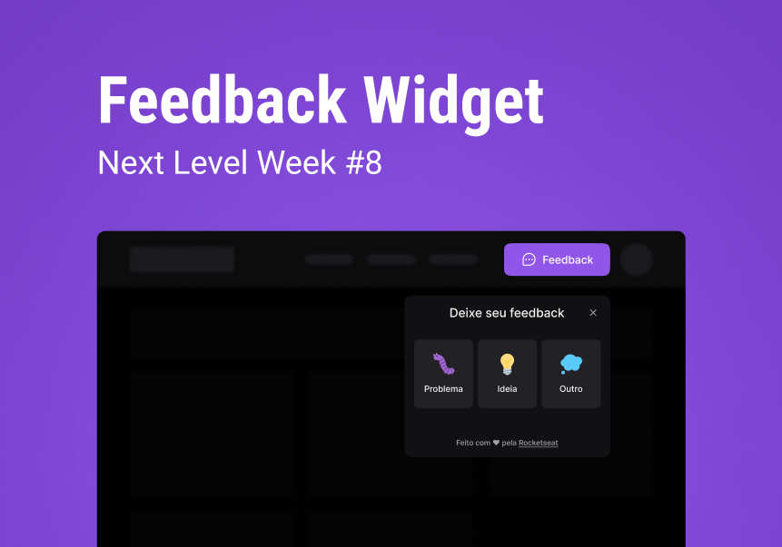

# Feedback Widget

## 🚀 Tecnologias

Esse projeto foi desenvolvido com as seguintes tecnologias:

- Typescript
- [React.js](https://pt-br.reactjs.org)
- [Node.js](https://nodejs.org/en/)
- [NPM](https://www.npmjs.com)
- [Tailwind](https://tailwindcss.com)
- [React Native](https://reactnative.dev)
- [Mailtrap](https://mailtrap.io)
- [Prisma](https://www.prisma.io)
- [Jest](https://jestjs.io/pt-BR/)
- [Expo](https://expo.dev)

## 💻 Projeto

Projeto desenvolvido na **Trilha Impulse** do **NLW Return**.

Esse projeto é um widget que pode ser usado em aplicações web e mobile para receber feedback de usuários.

## 🎨 Layout

Você pode visualizar o layout do projeto através [desse link](https://www.figma.com/community/file/1102912516166573468). É necessário ter uma conta no [Figma](https://www.figma.com) para acessá-lo.